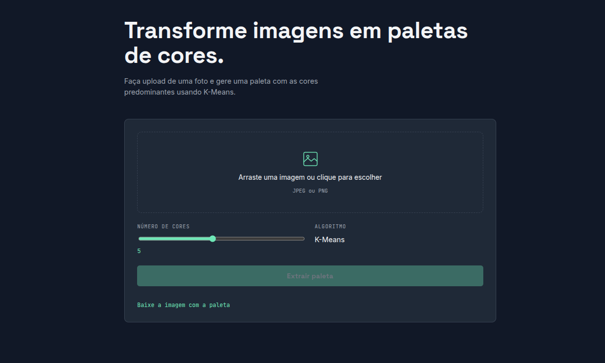
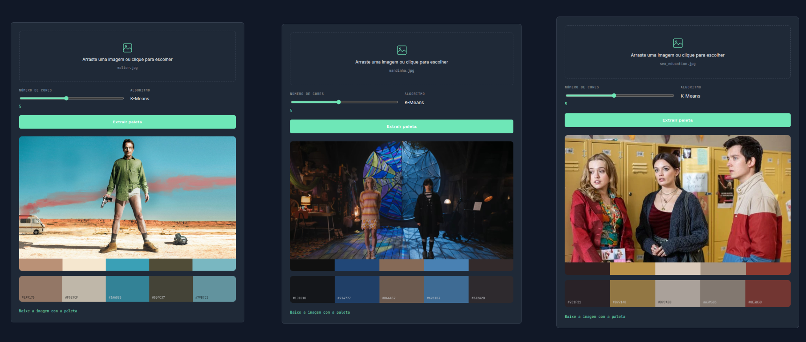
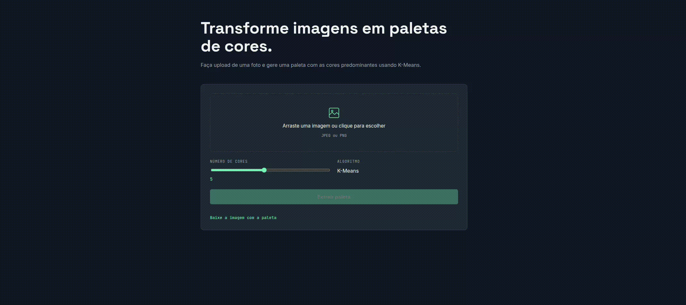

# K-Means Color Extractor

> Envie uma imagem. Receba as principais cores dela.

Aplicação construída com **FastAPI**, **OpenCV** e **Scikit-Learn** que identifica as cores predominantes de qualquer imagem via K-Means e retorna a imagem original com sua paleta de cor.

---

## Interface 



---

## Exemplos de aplicação



---


## Demo


---

## Como funciona

A imagem enviada passa pelo seguinte pipeline:

```
Upload da imagem e escolha do número de cores
        ↓
Redimensionamento para clustering
        ↓
Pixels → vetores [R, G, B]
        ↓
K-Means (N clusters)
        ↓
Geração da faixa de paleta 
        ↓
Junção da paleta com a imagem original
        ↓
Resposta: imagem 
```

---

## Stack

| Camada | Tecnologia |
|---|---|
| API | FastAPI + Uvicorn |
| Processamento de imagem | OpenCV + NumPy |
| Clustering | Scikit-Learn (KMeans) |
| Frontend | HTML + CSS + JavaScript |
| Container | Docker |

---

## Estrutura do projeto

```
.
├── backend
│   ├── routes
│   │   └── image_routes.py
│   ├── services
│   │   ├── extract_color.py
│   │   ├── palette_generator.py
│   │   └── palette_pipeline.py
│   ├── utils
│   │   └── image_utils.py
│   └── app.py
├── docs
│   ├── aplicacao.png
│   ├── demo.gif
│   └── interface.png
├── frontend
│   ├── index.html
│   ├── script.js
│   └── style.css
├── Dockerfile
├── README.md
└── requirements.txt
```

---

## Rodando localmente

```bash
# Clone o repositório
git clone https://github.com/jeronimofjr/Kmeans-color-extractor
cd Kmeans-color-extractor

# Crie e ative um ambiente virtual
python -m venv venv
source venv/bin/activate  # Windows: venv\Scripts\activate

# Instale as dependências
pip install -r requirements.txt

# Suba a Aplicação
uvicorn backend.app:app
```

Acesse:

- **Interface web** → http://localhost:8000
- **Documentação Swagger** → http://localhost:8000/docs

---

## Rodando com Docker

```bash
docker build -t kmeans-extractor-colors .
docker run -p 8000:8000 kmeans-extractor-colors
```

---

## Endpoint

### `POST /api/palette`

| Campo | Tipo | Padrão | Descrição |
|---|---|---|---|
| `file` | arquivo | — | Imagem JPEG ou PNG |
| `n_colors` | int | `10` | Número de cores para extrair (1–10) |


## Licença

MIT